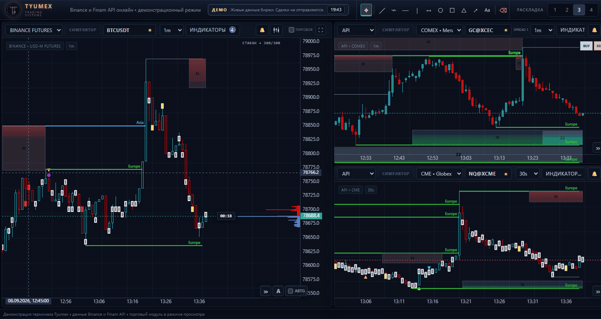

# Tyumex Terminal

Windows desktop trading terminal for multi-chart market analysis. One workspace holds several independent chart panes, each on its own data source: Binance Spot, Binance USD-M Futures, Hyperliquid, an exchange data API for CME and MOEX instruments, and local MetaTrader 4 and MetaTrader 5 terminals. Orders are sent to MetaTrader directly from the chart.

[](https://demo.tyumextrading.pro/)
[](https://tyumextrading.pro/)
[](https://github.com/Tyumex/tyumex-trading-terminal/releases/latest)
[](https://t.me/Tyumex_bot)

[](https://demo.tyumextrading.pro/)

<sub>Recorded in the public demo, not a mockup: live exchange data, cluster volume, zones and a 300-level depth ladder. Click the image to open the same terminal in your browser.</sub>

[Русская версия -> README.ru.md](README.ru.md) · Website: [tyumextrading.pro](https://tyumextrading.pro/)

This repository publishes the installer, screenshots and setup notes. Application sources are not part of the public package.

## Try it live, without installing

The public demo is the same build as the installer, running in your browser with no download and no account:

**[demo.tyumextrading.pro](https://demo.tyumextrading.pro/)** — or open [tyumextrading.pro](https://tyumextrading.pro/), where the same terminal runs inside the page.

- Three panes on live market data: BTCUSDT 1m with a 300-level depth ladder and cluster volume, XAUUSDT 1m with the trading module switched on, and NQ@XCME 30s from the exchange API.
- Zones and reversal marks are on, drawing tools and indicators work as they do in the product, and the layout can be rearranged.
- The trading module is real: it sizes the lot from risk and puts the stop and target on the chart. Sending an order answers "available in the paid version" — nothing is ever executed.
- Not open in the demo: terminal settings, MetaTrader sources, the bar replay simulator and order execution. Data comes from Binance and the exchange API only.
- A session lasts 20 minutes and 20 visitors are served at a time; a seat comes back 90 seconds after a tab is closed.
- The demo interface is in Russian.

## Download

| | |
|---|---|
| Version | **1.0.114** |
| Package | `TyumexTerminalNextSetup-1.0.114.exe` |
| SHA-256 | `AA21442F09FB9D0F1F6A169A5756408DD61ECAB2411D2A698098CED98BC819AA` |
| Platform | Windows 10 / 11, 64-bit |

**[Download the latest release](https://github.com/Tyumex/tyumex-trading-terminal/releases/latest)**

Verify the download before running it:

```powershell
Get-FileHash .\TyumexTerminalNextSetup-1.0.114.exe -Algorithm SHA256
```

The printed hash must match the SHA-256 above. If it does not, do not run the file.

This is a maintenance build: bugs are fixed and the terminal works faster. It supports MetaTrader 4 next to MetaTrader 5, with the same rules, risk sizing and license checks for both, and carries a rebuilt chart engine that is noticeably faster than earlier packages: drawing, panning and zooming stay smooth on dense sub-minute history, on long sessions kept open, and with several panes streaming at once. It installs as a separate product with its own shortcut, so it can run beside an older installation without touching its license, MetaTrader profiles or position state.

## Access

The terminal opens without a code, but it will not load new market data or accept new orders until a personal access code is activated. Existing positions can still be closed and protected without a code, so an expired key never traps you in a trade.

Codes are issued for 28 days by the official Telegram bot and are never published here:

**[Open @Tyumex_bot](https://t.me/Tyumex_bot)**

## Features

### Charts and data
- Multiple independent panes in one workspace, each with its own source, symbol and timeframe.
- Binance Spot, Binance USD-M Futures and Hyperliquid.
- Exchange API data for CME and MOEX instruments, including index futures such as NQ.
- Up to four local MetaTrader broker slots, MetaTrader 4 or MetaTrader 5, each pointed at your own installed terminal.
- Timeframes from 20s and 30s candles built out of ticks through 1m, 3m, 5m, 15m, 30m, 1h, 4h and 1D.
- Second-level history is filled from minute data on load, so a chart is usable immediately instead of waiting for ticks.
- Live streaming candles, session overlays and depth-style price levels.
- Cluster volume: traded volume per price inside each candle, with its own controls and labels that shrink to fit.
- Instrument catalog cached on disk, so symbol search stays usable when the data service is slow.

### Analysis
- Built-in SMA, EMA, RSI, MACD and Bollinger Bands.
- Twelve drawing tools shared across panes: trend line, ray, horizontal and vertical lines, rectangle, ellipse, triangle, arrow, text, measure, plus a selector and an eraser.
- One-shot mode returns to the cursor after a single drawing; the eraser clears a chart without hunting for individual objects.
- Drawings are anchored to price and time, so they survive timeframe and symbol switching.
- Palette color picker for chart and drawing colors.

### Trading through MetaTrader
- Market and pending orders, with pendings draggable directly on the chart.
- Position sizing from a fixed lot, a percentage of the deposit, or a cash amount.
- Stop-loss trade planner: draw the stop on the chart and the volume follows it. The stop itself can come from the extremum of the last three candles, a fixed number of points, or the plan drawn on the chart.
- Stop Loss and Take Profit set before the order is sent.
- Break-even shift and Safe Mode guards.
- Position and order management from the chart, including partial and full close.
- Bar replay simulator: replay history bar by bar with exchange-native order sizing and leverage, to rehearse an entry without risking an account.


## Access modes

| Mode | What it opens |
|---|---|
| Full | All features, trading on demo accounts. |
| Partner | Demo accounts plus one linked live account. |
| Viewer | Minute charts only; trading and closed features unavailable. |

The mode is re-checked every ten minutes. If a check cannot be completed, the terminal falls back to the narrowest mode rather than opening more than the honest one.

## Installation

1. Download `TyumexTerminalNextSetup-1.0.114.exe` from the [latest release](https://github.com/Tyumex/tyumex-trading-terminal/releases/latest) and check its SHA-256.
2. Run the installer. It installs into `%LOCALAPPDATA%\Programs\Tyumex Terminal Next` and creates a desktop shortcut, isolated from other Tyumex installations.
3. Start **Tyumex Terminal Next**.
4. For Binance, Hyperliquid and exchange API charts, pick the source and symbol in the chart header. Nothing else is required.
5. For MetaTrader charts, open settings and add the full path to your broker terminal: `terminal64.exe` for MetaTrader 5, `terminal.exe` for MetaTrader 4. The platform follows the file you pick. Keep that MetaTrader running and logged in.

Running a newer installer over an existing installation updates it in place. The license, MetaTrader profiles, workspace settings and managed-position state live under `%LOCALAPPDATA%\Tyumex Terminal\data` and survive updates.

No separate Python or Node.js installation is needed. Internet access is required for exchange data. MetaTrader data and trading require a locally installed and authorized MetaTrader 4 or MetaTrader 5 terminal.

## Requirements

- Windows 10 or 11, 64-bit.
- Internet connection for Binance, Hyperliquid and exchange API market data.
- MetaTrader 4 or MetaTrader 5, installed and logged in, for MetaTrader charts and trading.
- A personal access code from [@Tyumex_bot](https://t.me/Tyumex_bot).

## Security and privacy

- The application serves its interface on `127.0.0.1` only. Nothing is exposed to the local network.
- Requests are checked against DNS-rebinding attacks, so a web page cannot reach the terminal through your browser.
- A Content-Security-Policy header and CSRF checks protect the local interface.
- Broker credentials and API secrets are stored encrypted with Windows DPAPI, bound to your Windows account.
- Text coming from a broker is escaped everywhere it is displayed.
- Exchange market data works out of the box without any account of yours. To trade through the exchange API instead of MetaTrader, add your own token in settings and enable the personal token option.
- No trading credentials, account numbers or terminal paths leave your machine.

When reporting an issue, never post broker credentials, account numbers, license codes or local terminal paths, and blur them in screenshots.

## Notes

- Enter the exact symbol name used by your broker in MetaTrader. Broker naming differs.
- A MetaTrader 4 source has no market depth, so depth-style levels are not offered for it, and MT4 brokers publish no tick history: second-level bars are collected from the live stream while the terminal is open, and older bars come from M1.
- Buy and Sell controls send the order immediately. Check volume, Stop Loss and Take Profit before clicking.
- The terminal is a trading workspace, not a signal service. It gives no advice and guarantees no profit. All trading decisions and their outcomes are yours.

## License

Proprietary commercial software, not open source. The installer published here is licensed for personal use with an active access code; redistribution, resale, reverse engineering and modification are not permitted. See [LICENSE](LICENSE).

## Support

Access codes, current builds, activation questions and feedback: [@Tyumex_bot](https://t.me/Tyumex_bot).

The product site, the live demo and the license owner's cabinet: [tyumextrading.pro](https://tyumextrading.pro/).

---

<sub>Keywords: trading terminal, Windows trading terminal, desktop trading software, multi-chart trading platform, order flow terminal, footprint chart, cluster volume, volume delta, tick charts, second candles, 20s and 30s timeframes, custom timeframes, depth-style price levels, bar replay simulator, scalping software, day trading, intraday trading, position sizing, risk management, stop-loss planner, break-even automation, technical indicators, SMA, EMA, RSI, MACD, Bollinger Bands, chart drawing tools, MetaTrader 4, MT4, MetaTrader 5, MT5, MetaTrader order sending, MT4 expert advisor bridge, Binance, Binance Spot, Binance USD-M Futures, Hyperliquid, crypto trading terminal, forex terminal, futures terminal, CME, COMEX, MOEX, NQ, MNQ, ES, XAUUSD, BTCUSDT, ETHUSDT, index futures, market data, terminal for traders.</sub>
